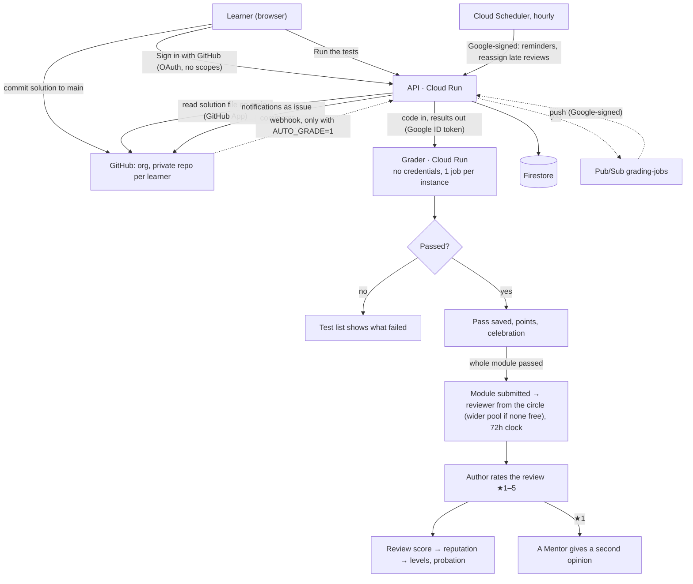

# Timirtbet: architecture

Timirtbet (ትምህርት ቤት) teaches JavaScript and Go through challenges, like HackerRank. Each finished module is reviewed by someone in the learner's **review circle**, and the author rates that review from 1 to 5 stars. Those ratings make up each reviewer's score and reputation.

Timirtbet is open source under the Apache License 2.0. The reference answers to the challenges are the one part kept private (a separate `solutions` repository), so learners can't copy them; the platform never needs them at run time.

## Pieces

| Piece | Runs on | Code |
|---|---|---|
| Web app | Firebase Hosting (CDN); `/api/**` rewritten to the API | `web/` |
| API | Cloud Run `timirtbet-api`, public | `platform/src/server.mjs`, `main.mjs api` |
| Grader | Cloud Run `timirtbet-grader`, private, 1 request per instance, no roles | `platform/src/grader-server.mjs`, `main.mjs grader` |
| Queue | Pub/Sub `grading-jobs` → push subscription → `/api/tasks/grade`; dead letters in `grading-failed`. Used only for automatic grading (`AUTO_GRADE=1`); "Run the tests" calls the grader directly | `queue.mjs`, `gcp.mjs` |
| Timer | Cloud Scheduler, hourly → `/api/tasks/reassign` | `pipeline.mjs` |
| Data | Firestore: `learners`, `circles`, `results`, `passes`, `submissions`, `reviewers`, `jobs`, `inbox` | `store/firestore.mjs` (same interface as `store/memory.mjs`) |
| Secrets | Secret Manager: GitHub App key, GitHub client secret, webhook secret, session secret | `deploy/setup.sh` |

## Privacy: what is stored

Sign-in uses GitHub OAuth with **no scopes**: Timirtbet sees only a public GitHub id and username. It uses the one-time token once and never stores it.

| Stored | Never collected |
|---|---|
| GitHub id and username | Name, email, phone number |
| Repository name, circle, class | Birth date, school, location |
| Code you submit, test results | Passwords (there are none) |
| Reviews written, ratings given | Tracking or analytics cookies |
| Who you follow | |

- **Notice at first sign-in:** a one-line notice says what is stored, and that it is stored in the United States.
- **Export:** `GET /api/me/export`.
- **Delete:** `DELETE /api/me` removes the learner's records and their repository, and takes them out of the organization. Reviews they wrote stay, unsigned.
- **Profiles:** any signed-in learner can open another's profile at `/u/{login}`: points, solved challenges, module progress, reviewer level and score, number of reviews, circle name, followers and following. Never their code.
- **Teachers:** a learner's teacher sees their progress only after the learner joins the class with its code (Profile → Your class). The teacher sees which challenges they passed or tried, how many test runs, last activity and module reviews; never their code. The learner can leave at any time, and the teacher can remove them.
- **Guests:** anyone can read every challenge and its tests without signing in.
- **Age:** GitHub accounts require age 13+.

## Sign-in and sessions

1. **Start:** `GET /api/auth/github` redirects to GitHub. A signed, 10-minute pending value is kept in the `__session` cookie. Firebase Hosting forwards only a cookie with that name to Cloud Run.
2. **Callback:** `GET /api/auth/github/callback` checks the state against the cookie, then reads the GitHub id and username.
3. **First sign-in:** the learner is added to the `learners` team (GitHub emails the invitation). They get a private repository `<org>/<username>-code` from the template, with push access. If GitHub is unavailable, this retries at the next sign-in.
4. **Session:** the cookie becomes a signed session: HttpOnly, Secure, SameSite=Lax, 30 days. Signing out raises `sessionVersion`, which ends every session. Every non-GET request checks its `Origin`.

## Review circles

| Rule | Detail |
|---|---|
| Size | Up to 8 learners |
| Joining | An 8-character invite code, with no 0/O or 1/I |
| Membership | One circle at a time |
| Owner | Can rotate the invite code. Leaving passes ownership to the next member; an empty circle is deleted |
| Assignment | Circle members who solved the challenge come first; the wider pool is used only when none of them is eligible |

## Classes (teacher views, `platform/src/classes.mjs`)

- Anyone signed in can create a class (`/teach`, or Teach a class in the account menu). A class has a name and an 8-letter code; a teacher can have up to 20 classes of up to 80 learners.
- A learner joins one class at a time by entering the code under Profile → Your class. Classes are separate from review circles.
- `/teach/{class}` shows the class: learners, active this week, average passed, modules reviewed, and a grid of learners × challenges (passed, tried, not started) grouped by module, with how many passed each challenge. It downloads as CSV (UTF-8 with a BOM, so Excel shows Amharic names).
- `/teach/{class}/{learner}` shows one learner: each challenge's status, number of runs, best score, last run and the first line of the last error; modules with no activity collapse to one row; and their module reviews.
- Only the class's teacher can read it; to anyone else a class id answers 404.

## Grading

- **Learners start it:** after committing, the learner presses **Run the tests** on the challenge page (`POST /api/check/{id}`). The API reads that challenge's solution file from `main` in their repository, grades it and records the result. Nothing is graded on push, so learners can commit as often as they like.
- **Automatic grading on push (off by default):** set `AUTO_GRADE=1` on the API to grade every push and pull request as well, as described below. Without it, webhooks are acknowledged and skipped.
- **From Git (only with `AUTO_GRADE=1`):** GitHub sends `push` (to `main`) and `pull_request` events to `/api/hooks/github`.
  - The API checks the HMAC signature and maps changed files to challenges: `js/<id>/solution.js` and `go/<id_with_underscores>/solution.go`.
  - It claims the job `repo@sha` once, so a repeated webhook is graded only once, and publishes it to Pub/Sub.
- **Processing:** Pub/Sub pushes the job to `/api/tasks/grade` with a Google-signed token. The API checks the token's signature, issuer, audience, expiry and service account, then processes the job.
  - For a push, it downloads the commit and reads only the changed solution files.
  - It sends `{exerciseId, code}` items to the grader with a Google ID token.
- **Grader:** writes the files into a fresh temporary folder and runs the tests. It returns results (with `graderVersion`) and holds nothing.
  - JavaScript (`challenges/js/grade.mjs`, kept in `authoring/grade.mjs`): each test runs in its own worker thread (3 s, 128 MB) in a fresh `node:vm` realm with no `process`, `require` or host objects. The standard globals are frozen before the learner's code loads, and each test gets the original built-ins and the checks (`eq`, `near`, `ok`, `throws`) as private parameters. A test passes only if every one of its checks ran and passed and it reached its end, and results are collected by the grader, never printed by the learner's code. So redefining `eq`, patching `Date` or `Object.is`, printing a fake result or calling `process.exit` changes nothing. Around that, Node runs with `--permission` (reads only the tests and the answer; no child processes or network), `--disallow-code-generation-from-strings` and a memory cap. 30 seconds per challenge in total.
  - Go: `go test -race`, 60 seconds per challenge, with no module downloads. Before compiling, imports are checked against an allow-list of standard packages (`GO_IMPORTS` in `grader.mjs`: no `os`, `net`, `syscall`, `unsafe`, `reflect`, `testing`, `embed` or cgo) and `//go:` directives are refused. Pass or fail comes from the exit code, so printed `--- PASS` lines cannot fake a pass.
  - **Extra checks (hidden tests):** more inputs and edge cases that learners never see, so a solution must work in general, not only for the examples. They are written next to the answers in the private repository (`solutions/hidden/<id>.json` for JS, `solutions/hidden/<id>_test.go` with `TestHidden*` functions for Go), checked by `node authoring/build.mjs` (every answer passes them, every starter fails them) and bundled into `solutions/hidden-tests.json`. `bash deploy/upload-hidden-tests.sh` stores the bundle in the Secret Manager secret `hidden-tests`, readable only by the grader, and mounts it at `HIDDEN_TESTS_FILE`. Results report them only as "Extra check N" with a generic message, and a challenge is solved only when its tests and its extra checks all pass. Without the secret, the grader runs the visible tests only.
- **Recording:** each result is saved. A pass also keeps the latest passing code for that challenge. A single pass is not reviewed on its own.
- **Submitting is done from GitHub; there is no code editor on the site.** Each challenge page shows the task, the tests, how to push, and the result of the learner's latest push (`GET /api/results/{id}`, `GET /api/passes/{id}`). A solution counts (and can go into a module review) only when the learner pushes it to `main` in their own repository and the grader passes it; the pass remembers that its code came from a push (`codeSource: "git"`). Each push gives an in-app notification (passed and saved, or how many tests passed) and, when a module is complete, a "submit it for review" notification. In development, `POST /api/dev/push` acts like a push.
- **Modules:** challenges are grouped into modules of 3–5 (`challenges/modules.json`, 4 per language). When every challenge in a module has passed, the learner submits the module (`POST /api/modules/{id}/submit`): one submission with the latest passing code of each challenge. Reviewers only ever get whole modules: single-challenge submissions left from before modules existed are withdrawn at API start-up and by the hourly task, freeing the reviewer's slot.
- **Feedback on GitHub:** the commit gets a `timirtbet/tests` status, and pull requests get a comment listing failing tests.
- **Retries:** if processing fails, Pub/Sub retries with a 10–600 second backoff, and moves the job to `grading-failed` after 5 attempts.

The GitHub Actions workflow in each learner's repository runs only when they start it from the Actions tab. Learners can edit it, so its result never counts.

## Peer review and reputation (`platform/src/reviews.mjs`)

Reviewer counters are stored as `{ratings, starsSum, pointsSum, openReviews}` and updated in a transaction when a rating arrives, so nothing ever recounts history.

- **Who can review:** only someone who finished the whole module; never the author; nobody on probation; nobody with 3 open reviews. Circle members come first. Advanced challenges prefer Helpful reviewers or above. Higher score, higher level and fewer open reviews make a pick more likely.
- **The review:** a rubric (Correctness, Readability, Style, each Needs work, Good or Excellent) and a comment of 40–4000 characters. The reviewer doesn't see who wrote the code. The author sees who the reviewer is (GitHub username and level), so they know who to wait for and can nudge them.
- **Rating:** only the author rates, once, from 1 to 5 stars.
- **Review score:** `(5 × 3.5 + sum of stars) ÷ (5 + number of ratings)`.
- **Points per rating:** ★5 +10 · ★4 +6 · ★3 +2 · ★2 −3 · ★1 −6. Reputation never shows below 0.
- **Levels:**

  | Level | Points needed |
  |---|---|
  | New | 0 |
  | Helpful | 30 |
  | Trusted | 100 |
  | Mentor | 250 |
- **Probation:** 4 or more ratings with a score under 3.0. No new reviews until the score recovers.
- **The 72-hour clock:** a review is due 72 hours after it was assigned. The author and the reviewer both see the same countdown (on the module panel, the track page, the review queue and the review page). It turns amber under 24 hours and red under 6.
- **Nudge:** while a module is in review, its author can nudge the reviewer at most once every 12 hours. The reviewer gets a notification in the bell and on GitHub.
- **Reminder and stale reviews:** after 48 hours without a review, the reviewer gets one reminder. A review not written within 72 hours moves to someone else. The hourly task also assigns submissions that were waiting for a free reviewer, and so does any new pass.
- **Second opinions:** a review rated ★1 is flagged. Mentors see flagged reviews and can add a second opinion, which the author then sees.

## Notifications (`platform/src/notify.mjs`)

Every peer-review event reaches the learner in two places:

1. **The bell in the app.** Each learner has one `inbox` document holding the latest 30 notifications and an unread count. The page checks it every 45 seconds while open (every 3 minutes in a background tab, and at once when the tab comes back), shows a short pop-up for anything new, and marks everything read when the bell is opened. Clicking a notification opens the review to write, the module to rate, or the Reviews page.
2. **GitHub.** Timirtbet opens one issue called "Timirtbet notifications" in the learner's own repository and adds an `@username` comment for each event. GitHub then sends it by email or to the GitHub mobile app, following the learner's own GitHub notification settings, so Timirtbet never needs an email address. Set `GITHUB_NOTIFY=0` to turn this off. It needs the app's existing Issues: Read and write permission.

| Event | Who gets it | Bell | GitHub |
|---|---|---|---|
| `review_assigned`: a module was assigned to you | reviewer | yes | yes |
| `review_due`: 48 hours passed, 24 left (sent once) | reviewer | yes | yes |
| `review_moved`: 72 hours passed, the review went to someone else | old reviewer | yes | no |
| `review_received`: your module was reviewed, rate it | author | yes | yes |
| `review_rated`: your review got ★n (+/− points) | reviewer | yes | yes |
| `level_up`: you reached Helpful, Trusted or Mentor | reviewer | yes | no |
| `second_opinion`: a Mentor added a second opinion | author | yes | yes |
| `review_nudge`: the author is waiting for your review | reviewer | yes | yes |
| `new_follower`: someone started following you | the person followed | yes | no |

A failed notification is logged and never blocks the review itself.

## Web addresses

The web app is one page, but every screen has its own address and browser-tab title, so links can be shared and Back works. Firebase Hosting serves `index.html` for every path except `/api/**`.

| Address | Screen |
|---|---|
| `/` | The two tracks |
| `/challenges/js`, `/challenges/go` | A track, all modules |
| `/challenges/js/basic`, `/challenges/js/advanced` | A track, one level |
| `/challenges/js/basic/vars` | A challenge (its id without the `js-`/`go-` prefix) |
| `/reviews`, `/reviews/{submission}` | Reviews to write, and one review |
| `/circle`, `/profile`, `/signin` | Circle, your account, getting started |
| `/u/{github-login}` | A learner's profile |
| `/teach`, `/teach/{class}`, `/teach/{class}/{learner}` | A teacher's classes, one class, one learner |

After signing in with GitHub, the learner returns to the page they were on.

## API

| Route | Who |
|---|---|
| `GET /api/auth/github`, `/callback`; `POST /api/auth/logout` | anyone / you |
| `GET /api/me`, `POST /api/me/notice`, `GET /api/me/export`, `DELETE /api/me` | you |
| `POST /api/circles`, `/join`, `/leave`, `/{id}/invite-code` | you (owner for the code) |
| `GET`/`POST /api/classes`; `POST /api/classes/join`, `/leave` | you |
| `GET /api/classes/{id}`, `/{id}/export.csv`, `/{id}/learners/{learnerId}`; `POST /{id}/code`, `/{id}/remove`; `DELETE /api/classes/{id}` | the class's teacher |
| `GET /api/results/{exerciseId}` (your latest push's test results), `GET /api/passes/{exerciseId}` (your saved solution) | you |
| `POST /api/modules/{id}/submit` (send a finished module for review) | you |
| `GET /api/notifications`, `POST /api/notifications/read` | you |
| `GET /api/submissions/mine` (with your reviewer, `dueAt` and `nudgeAfter`), `GET /api/reviews/queue` (with `dueAt`), `GET /api/reviews/given` | you |
| `POST /api/submissions/{id}/nudge` (once every 12 hours) | author |
| `GET /api/users/{login}`, `GET /api/users/{login}/followers`, `/following`; `POST`/`DELETE /api/users/{login}/follow` | signed in |
| `POST /api/submissions/{id}/review` | assigned reviewer |
| `POST /api/submissions/{id}/rating` | author |
| `GET /api/reviews/flagged`, `POST /api/submissions/{id}/second-opinion` | Mentors |
| `POST /api/hooks/github` | GitHub (HMAC signature) |
| `POST /api/tasks/grade`, `POST /api/tasks/reassign` | Pub/Sub, Cloud Scheduler (Google-signed token from `tasks-invoker`) |

## Service accounts

| Account | Can |
|---|---|
| `timirtbet-api` | Firestore read/write, its 4 secrets, publish to `grading-jobs`, invoke the grader |
| `timirtbet-grader` | Read the `hidden-tests` secret (mounted as a file) |
| `tasks-invoker` | Invoke the API (Pub/Sub push and Cloud Scheduler sign in as this) |
| `timirtbet-deploy` | Deploy Cloud Run and Hosting, push images, manage the subscription and scheduler. Used only by GitHub Actions via Workload Identity Federation (no keys) |

## GitHub App settings

- **Organization permissions:** Members (read and write).
- **Repository permissions:**
  - Administration: read and write (create and delete learner repositories, add collaborators)
  - Contents: read
  - Commit statuses: read and write
  - Pull requests: read and write
  - Issues: read and write
- **Events:** `push`, `pull_request`.
- **Webhook URL:** `https://timirtbet-api-<project-number>.<region>.run.app/api/hooks/github`
- **Callback URL:** `https://<app>/api/auth/github/callback`
- **User permissions:** none requested. Install the app on all repositories.

## Free tier (us-central1)

The main limits are:

- **Cloud Run:** 2 million requests, 180,000 vCPU-seconds and 360,000 GiB-seconds a month.
- **Firestore:** 50,000 reads, 20,000 writes and 1 GiB stored per day.
- **Firebase Hosting:** 360 MB a day.

That covers roughly 2,500 learners active on the same day; Firestore's limits run out first. There is no SMS and no file hosting, so nothing is paid by default. A budget alert fires at $1.

## Before opening to everyone

- Route the grader's outbound traffic through a VPC with a deny-all firewall rule, so learners' code cannot reach the internet.
- Run `npm run test:firestore` against the emulator once.
- Do a first deploy to a test project.
